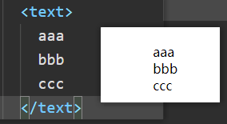

# blink 项目前端


### 前置补充

#### 小程序基础

#### 懂flex布局


## 组件

### like组件开发

#### rpx和px使用场景

在大部分情况下，我们都使用 **rpx**单位，因为rpx可以进行自适应，在屏幕尺寸和分辨率发生改变的情况下，会自动进行适应。

而px则不会进行适应。

**一般来说：**例如像字体这种，我们有时候不让其自适应。有时候我们设置 边框，border 也可能不应该自适应。


**所有的页面，小程序默认在最外层加上了page标签。**所以有些公共的样式我们可以写在app.wxss文件里面。也要注意，不是所有的公共样式都会被其他页面或者组件继承。比如我们设置的全局页面背景颜色，是不会被组件继承的。但是大部分css样式都是可以被页面继承的。


#### 自适应弹性盒模型

设置display属性的值为 inline-flex。整体盒外模型是自适应，内部还是flex盒子。也还是蛮不错的选择。

```css
.container{
  /* 设置弹性盒，且宽度高度还是自适应 inline-flex */
  display: inline-flex;
  flex-direction: row;
  /* 给一个内边距 */
  padding-top: 10rpx;
}
```


#### 自定义触发事件

**triggerEvent()**方法

- 参数一：自定义事件名称
- 参数二：js对象，用来传递我们当前的数据，提供给外界的监听函数。默认在外界接收参数的detail属性下。**一般也就是在event.detail**
- 参数三：触发事件的选项，对象类型。可选属性有三：
  - bubbles： 是否冒泡，默认false
  - composed： 事件是否可以穿越组件边界，为false时，事件将只能在引用组件的节点树上触发，不进入其他任何组件内部，默认false
  - capturePhase：默认false，事件是否拥有捕获阶段


|    选项名    |  类型   | 是否必填 | 默认值 |                             描述                             |
| :----------: | :-----: | :------: | :----: | :----------------------------------------------------------: |
|   bubbles    | Boolean |    否    | false  |                         事件是否冒泡                         |
|   composed   | Boolean |    否    | false  | 事件是否可以穿越组件边界，为false时，事件将只能在引用组件的节点树上触发，不进入其他任何组件内部 |
| capturePhase | Boolean |    否    | false  |                     事件是否拥有捕获阶段                     |


#### 组件的properties属性和data属性

在定义组件的时候，我们在properties中定义的数据，是提供给外界的出口属性，一般小程序会给其我们设置属性的默认值的，当然也可以通过value属性指定默认值。而在data中定义属性的时候，如果直接将某个属性赋值为Number，String，等等，是不会给其该属性的默认值的。这些属性本来就是构造函数。

**这两个属性，在最后都会合并到一个对象中。也就是properties中和data中定义的属性，都会合并到一起的。**所以我们在定义变量的时候，这两个地方的变量不要设置为同名的变量。


##### properties属性定义的属性的observer属性

observer属性的类型是一个函数。在这个函数里面，不要修改属性自己的值。不然会引起无限递归。

```js
properties: {
    // 期刊号
    index: {
      type: String,
      /**
       * 当前属性发生改变的时候，会执行该函数的内容
       * 不能在这个里面更新 index 的值 我们应该修改 _index
       * 修改index 的值会出现无限递归，因为每次修改值都会调用这个函数
       */
      observer(newVal, oldVal, changePath) {
        const val = newVal < 10 ? "0" + newVal : newVal;
        this.setData({
            // 直接无限递归了
            // index:val,
          _index: val
        })
      }
    }
  }
```


#### 组件的代码复用：behavior

behavior：行为。

给多个组件定义共同的行为。

将多个组件的共性抽取出来，定义在一个单独的文件中。供多个组件一起使用。

进行代码的复用，是通过定义 **Behavior**来实现的。

可以把该文件认为和组件的js文件基本一致，都可以定义properties，data，methods等属性。

也可以有生命周期。

```js
// Behavior 就是一个构造器

export default Behavior({
  properties: {
    // 图片
    img: String,
    // 内容
    content: String
  },
  data: {},
  methods: {

  }
})
```

**组件想要使用这些定义好的行为，需要显示的继承。一个组件可以继承多个行为，就有了他们共有的属性。**

```js
Component({
  // 指定继承的behavior，可以继承多个，继承了就有了这些定义好的属性和方法等
  behaviors:[classicBeha],
})
```

继承的生命周期和组件内部定义的生命周期会合并。但是像属性和方法，组件内部定义了的为主，继承的属性和组件内部属性发生冲突时，以组件内部为主。多继承时，继承的属性发生冲突的时候，以最后一个聚餐的behavior为准。


#### 注意promise方式调用get/setStorege

不管是直接传入回调函数，还是以promise来执行回调函数。返回值的data属性才是我们实际拿到的数据。res并不是。

```js
wx.getStorage({
  key: 'key',
  success (res) {
    console.log(res.data)
  }
})
wx.getStorage({
  key: 'key'
}).then(res=>{
    console.log(res.data)
})
```


#### css代码复用解决

```css
@import "需要复用的wxss文件";
<!-- 别忘了后面需要分号结束 -->
```


#### 背景音频管理对象wx.getBackgroundAudioManager();

小程序将背景音频相关的操作，都放到该对象中。注意：只要给该对象赋值了src属性，就会自动开始播放了。

```js
// 背景音乐管理对象
const mgr = wx.getBackgroundAudioManager();

// 切换暂停和播放的图标
      this.setData({
        playing: !this.data.playing
      });
      if (this.data.playing) {
        // 音乐播放
        mgr.src = this.properties.musicSrc;
        mgr.title = "听雨少年！";
        console.log(this.properties.musicSrc);
      }else{
        // 音乐暂停
        mgr.pause();
      }
```

在现在的小程序，背景音频对象的 **title属性和src属性属于必填项，不然不会生效。**


当然，如上配置出现暂停的时候，会报上面的错误。

需要在app.json中配置小程序退到后台时，也可以继续播放音频的属性。

```json
{
    "requiredBackgroundModes": ["audio","location"],
}
```

申明需要后台运行的能力，类型为数组。目前支持以下项目：

- `audio`: 后台音乐播放
- `location`: 后台定位


#### wx.navigateTo(Object object)

****以 [Promise 风格](https://developers.weixin.qq.com/miniprogram/dev/framework/app-service/api.html#异步-API-返回-Promise) 调用**：支持**

保留当前页面，跳转到应用内的某个页面。相当于打开的页面是子页面。

注意：跳转页面传递参数时：只能通过查询字符串进行传递。

需要跳转的应用内非 tabBar 的页面的路径 (代码包路径), 路径后可以带参数。参数与路径之间使用 `?` 分隔，参数键与参数值用 `=` 相连，不同参数用 `&` 分隔；如 'path?key=value&key2=value2'


#### 组件插槽slot

和vue了插槽很相似。插槽就是占位使用。如果我们需要插槽的位置插入标签，组件等，就可以直接在外面插入，替换插槽。不需要则不需要传递。

```html
<!-- 组件插槽的使用 -->
  <!-- 这是具名插槽，使用的时候也需要指定插槽的名字 -->
  <!-- 如果只有一个插槽，是可以不指定插槽的名称的，那样外面使用的时候也可以不指定插槽的名称 -->
<slot name="after"></slot>
```

在组件的js文件中配置插槽生效。启用插槽。

```js
Component({
    // 需要在options属性里面 设置 multipleSlots 的值为true
  // 插槽才能起作用
  options:{
    multipleSlots:true
  }
})
```

插槽的使用

```html
<!-- 插槽的使用 -->
<!-- 直接在标签上 通过slot属性指定要替换的插槽 -->
<text slot="after">{{"+" + comment.nums}}</text>
```


##### 注意

对于组件插槽，发现了一个特点。

如果说，组件只有一个默认插槽，也就是插槽只有一个，而且没名字，那么，不需要再组件的js文件中设置options对象的multipleSlots属性为true。

设置这个属性为true，主要是为了开启多插槽的使用。

也就是说，只有默认插槽的情况下，不需要配置该属性的。

**还有，如果将其他组件用来替换插槽，其他组件是需要在当前所在的页面的json文件中进行配置的。**


##### 组件样式

组件对应 `wxss` 文件的样式，只对组件wxml内的节点生效。

```css
#a { } /* 在组件中不能使用 */
[a] { } /* 在组件中不能使用 */
button { } /* 在组件中不能使用 */
.a > .b { } /* 除非 .a 是 view 组件节点，否则不一定会生效 */
```


#### 外部样式的使用

有时，组件希望接受外部传入的样式类。此时可以在 `Component` 中用 `externalClasses` 定义段定义若干个外部样式类。

这个特性可以用于实现类似于 `view` 组件的 `hover-class` 属性：页面可以提供一个样式类，赋予 `view` 的 `hover-class` ，这个样式类本身写在页面中而非 `view` 组件的实现中。

**注意：在同一个节点上使用普通样式类和外部样式类时，两个类的优先级是未定义的，因此最好避免这种情况。**

上面这句话就是废话，说白了，就是你传递的外部样式，和我组件的默认样式如果发生冲突的时候，**而你又没有指定两个冲突样式的优先级，**那我就不确定到底使用的是哪一个样式。

因此传递外部样式的时候，建议还是指定某些不生效样式的优先级。

##### 定义外部样式

```js
 // 外部样式 在组件内定义好样式名，然后实际引用的样式是外部传递的
  externalClasses:["tag-class"],
```

##### 组件内使用

```html
<view class="container tag-class"></view>
```

**感觉小程序在外部样式这一块做的不是很好。正常来说，放到后面的样式，就应该覆盖前面的样式。也就是样式发生冲突的时候，而优先级是一样的情况下，tag-class的样式就应该覆盖container的样式，不然，每次还需要强制优先级多麻烦。**

##### 页面传递外部样式给组件

```html
<!-- 传递外部样式 -->
<m-tag tag-class="ex-tag1"/>
```

我们将在页面的wxss定义的样式名称，也就是class属性值，直接传递给组件内部。


#### text组件不要轻易换行

```html
<text>aaaaaaaa
bbbbbb
cccccccc</text>
```

我们在书写内容的时候，如果因为某些原因，比如不美观等，我们敲下回车进行换行，那么，解析的时候，**呈现在页面上的内容，也会因为你的回车换行而换行。**




### wxs

WXS（WeiXin Script）是小程序的一套脚本语言，结合 `WXML`，可以构建出页面的结构

[wxs的使用](https://developers.weixin.qq.com/miniprogram/dev/framework/view/wxs/)

1. WXS 不依赖于运行时的基础库版本，可以在所有版本的小程序中运行。
2. WXS 与 JavaScript 是不同的语言，有自己的语法，并不和 JavaScript 一致。
3. WXS 的运行环境和其他 JavaScript 代码是隔离的，WXS 中不能调用其他 JavaScript 文件中定义的函数，也不能调用小程序提供的API。
4. WXS 函数不能作为组件的事件回调。
5. 由于运行环境的差异，在 iOS 设备上小程序内的 WXS 会比 JavaScript 代码快 2 ~ 20 倍。在 android 设备上二者运行效率无差异。

#### wxs模块

一个wxs文件，或者写在页面上的wxs标签里面的代码，就是一个单独的wxs模块。

##### 模块

每一个 `.wxs` 文件和 `<wxs>` 标签都是一个单独的模块。

每个模块都有自己独立的作用域。即在一个模块里面定义的变量与函数，默认为私有的，对其他模块不可见。

一个模块要想对外暴露其内部的私有变量与函数，只能通过 `module.exports` 实现。

**使用wxs的时候，请参照js的es5标准。不要使用es6及其新特性。无法使用的。**

所以我们可以用wxs来写过滤器等等。

##### wxs的基本使用

定义一个过滤器，来处理文本中被转义的换行符。

```js
// 用来过滤掉 \n 解析为换行等
/**
 * wxs和js类似。但是，wxs并不是js。wxs有自己独立的运行环境。
 * @param {String} text 文本
 */
var format = function (text) { // 只能使用var定义（目前是这样），也不能使用箭头函数
  // 获取正则表达式的对象 （参照官方文档）
  if(!text) return;
  var reg = getRegExp("\\\\n","g");
  return text.replace(reg,"\n&nbsp;&nbsp;&nbsp;&nbsp;&nbsp;&nbsp;&nbsp;&nbsp;");
}

module.exports.format = format;

```

##### wxs在页面的使用

我们需要导入外部定义的wxs，并指定模块名称。

```html
<!-- 引入wxs模块 ,并使用module属性指定模块名（任意名称）-->
<wxs src="../../utils/filter.wxs" module="util" />
```

引入后的页面上使用，就可以通过我们定义的模块名使用我们导出的函数或者变量等。

```html
<!-- 数据绑定的时候，这个函数会被执行两次，数据初始化一次，数据更新一次 -->
    <!-- decode 解码我们的某些特殊字符 -->
    <!-- decode可以解析的有 &nbsp; &lt; &gt; &amp; &apos; &ensp; &emsp; -->
    <text decode="{{true}}" class="content">{{util.format(bookDetail.summary)}}</text>
```

**将某些需要复用的函数等卸载wxs文件中，可以进行复用。**


#### 图片预览wx.previewImage

```js
wx: wx.previewImage({
      // 预览的图片，可以有多个 值是src的值 也就是链接地址
      urls: [this.data.movie.image],
      // 当前预览的第一张图片
      current: this.data.movie.image
    })
```


### 串行和并行

同时发起多个请求，如果服务器支持多线程，同时可以处理多个请求，那么就是并行。很明显并行是比穿行效率高的。


#### Promise.all/race

使用Promise的静态方法，all方法可以将多个promise对象合并为一个promise，当所有的promise处理完毕后，才会返回新的promise。这个返回的promise可以视作为多个我们传递的promise对象和合集。

```js
const getBookDetail = bookModel.getBookDetail(bookId);
const getComments = bookModel.getBookComments(bookId);
const getLikeStatus = bookModel.getBookLikeStatus(bookId);
Promise.all([getBookDetail, getComments, getLikeStatus])
    .then((res) => {
    // 返回值res就是一个数组，传递到all的参数数组有几个元素
    // res这个返回值数组就有几个元素
    this.setData({
        bookDetail: res[0],
        comments: res[1].comments,
        likeStatus: res[2].like_status,
        likeCount: res[2].fav_nums
    })
    // 隐藏加载中的提示框
    wx.hideLoading();
})
```

race方法和all方法则相反，只要有任何一个传递的promise对象率先完成了请求，就会执行返回值的回调。不会等待其他的，**所以：rece方法返回的promise对象，我们的then方法里面只会有第一个请求完成的那个promise的返回值。**

也就是res只有一个返回值。


### 加载更多

实现类似瀑布屏一样的效果，我们有两种解决方案

1. 使用小程序的scroll-view组件，比较简单
2. 使用 Page页面的 onReachBottom事件来实现加载更多的效果。

#### onReachBottom

该处理函数在当前页面上拉触底事件的触发的时候，会进行回调该函数。

```js
onReachBottom() {
    // 触发该函数，让搜索组件加载更多的数据
    this.setData({
      more: randomString(32)
    })
  }
```

在页面触发该函数，然后让组件内部就开始发起请求，加载更多数据。randomString(32)是生成指定位数随机字符串的自定义函数。


### search组件加锁/避免死锁

开发search组件的时候，在发起请求的时候，我们一般都会在请求之前进行加锁，避免在请求的数据没有返回之前，发起二次请求，这时候，我们是讲锁的释放防到了请求成功的回调函数中，这种情况下，一旦发起的请求失败，比如突然断网，这时候就会处于锁无法释放。

在请求失败的请求下，我们也需要释放锁。这里要注意。


### open-data

使用该标签可以展示微信提供的接口。也就是展示微信开放的数据。比如使用这个标签的type属性看样子展示用户头像，用户昵称等。

```html
  <!-- 获取用户信息 调用小程序的接口 不需要授权就能显示用户的头像和昵称 -->
  <!-- 这种方式只能展示，无法在js中获取用户的信息 -->
  <open-data class="avatar avatar-position" type="userAvatarUrl" />
```

如果只是展示用户的某些数据，可以使用这个标签。但是如果需要获取用户信息提交到服务器，那么我们必然是需要在js中获取到用户信息的。那么这种方式是不可行的。


### 微信小程序用户授权

#### wx.getUserProfile(Object object)

截止21年9月，目前新版的授权方式发生了比较大的变化。

获取用户信息。页面产生点击事件（例如 `button` 上 `bindtap` 的回调中）后才可调用，每次请求都会弹出授权窗口，用户同意后返回 `userInfo`。该接口用于替换 `wx.getUserInfo`

**也就是说：** 只有在页面发生了点击行为的回调函数中，才能通过这个getUserProfile方法进行弹出用户授权的提示框。而且即使授权过，也可以再次点击授权，用户同意授权后可以在该方法的回调函数中拿到用户授权后的信息。

```html
  <button bindtap="getUserInfo">授权</button>
```

```js
getUserInfo(event){
    
    wx.getUserProfile({
      lang:"zh_CN",
      desc:"是否授权",
    }).then((res)=>{
      console.log(res);
    })
  }
```

这种方式每次只有点击以后才能获取到授权后的用户数据。


#### wx.getUserInfo()


